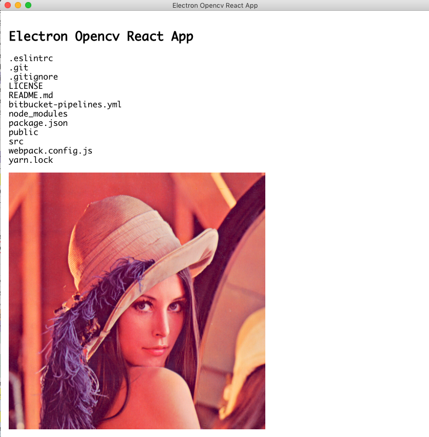

# Electron Opencv React App

This project is a playground to play with electron, opencv, react, nodejs, canvas

Tested on
```
➜  node -v
v8.6.0
➜  npm -v
5.6.0
➜  yarn -v
1.3.2
➜  brew -v
Homebrew 1.4.1
Homebrew/homebrew-core (git revision dbf4d; last commit 2017-12-18)
➜  pkg-config opencv --libs
-L/usr/local/Cellar/opencv/3.3.1_1/lib ...
```

Install on mac
```
brew tap homebrew/science
brew install opencv
yarn
```



